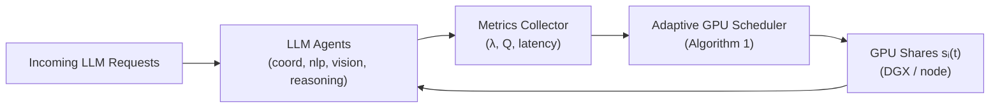

# Adaptive GPU Resource Allocation for Multi-Agent Collaborative Reasoning

Implementation of the paper's Algorithm 1 — priority-weighted, demand-proportional GPU allocation — evaluated against static and round-robin baselines.

---


---
## Architecture Overview



---
## Quick Start

1. **Install dependencies**

   ```bash
   pip install -r requirements.txt
   pip install -e .          # installs adaptive_gpu as a package
   ```

2. **Run both Backend & Frontend (Unified Launcher)**
   
   ```bash
   python run_app.py
   ```

3. **Run a paper comparison (300s experiment)**

   ```bash
   bash scripts/run_simulation.sh
   ```

Results appear in `output/metrics/` (CSV) and `output/figures/` (PNG charts).

---

## Project Structure

```text
adaptive-gpu-scheduler/
├── backend/                    # FastAPI services for the web dashboard
├── frontend/                   # Next.js dashboard for real-time visualization
├── configs/                    # All experiment parameters (YAML)
│   ├── agents.yaml             # Agent priorities, min GPU shares, service times
│   ├── workloads.yaml          # Arrival rates (paper Table 1: 80/40/45/25 req/s)
│   └── policies.yaml           # Policy-specific settings
│
├── src/adaptive_gpu/
│   ├── scheduler/              # THE PAPER'S CORE
│   │   ├── adaptive_allocator.py   # Algorithm 1: d_i=(λ_i×R_i)/P_i  O(N)
│   │   ├── static_allocator.py     # Baseline 1: equal static share
│   │   └── round_robin.py          # Baseline 2: rotating boost share
│   ├── simulation/
│   │   ├── environment.py      # Worker threads + allocation control loop
│   │   └── gpu_model.py        # GPU share → service time scaling (with penalties)
│   ├── evaluation/             # compare_policies.py, summarize.py (paper plots)
│
├── output/
│   ├── metrics/                # Latest CSV comparison data
│   ├── figures/                # Paper-faithful PNG plots (Latency, Throughput)
│   └── runs/                   # Archived historical results per run_id
```

---

## Algorithm 1 — Implementation

Located in `src/adaptive_gpu/scheduler/adaptive_allocator.py`.
Faithfully implements **Algorithm 1** from the paper (arXiv:2512.22149v1, Section III.C):

```text
For each agent i:
    d_i = (λ_i × R_i) / P_i

    where:
      λ_i = arrival rate (req/s) in 10-second sliding window
      R_i = minimum GPU resource requirement (fraction of total)
      P_i = priority level (1=high, 2=medium — lower value = more resources)

D_total = Σ d_i
g_i_prop = (d_i / D_total) × G_total   (proportional share)
g_i      = max(R_i, g_i_prop)           (enforce minimum — prevent starvation)

If Σ g_i > G_total:
    g_i = g_i / Σ g_j × G_total        (normalize to capacity)
```

Complexity: **O(N)** — enables millisecond-scale real-time reallocation.

---

## Three Policies Compared

| Policy        | Description                                             | Order in Paper |
|---------------|---------------------------------------------------------|----------------|
| **static**    | Equal share (1/N) for all agents, never changes         | 1st            |
| **round_robin** | Rotating boost share across agents (RR Penalty applied)| 2nd            |
| **adaptive**  | Algorithm 1 — dynamic, demand-aware (Proposed)          | 3rd            |

---

## Paper Metrics Reproduced

- **Average Latency (s):** Smart unit conversion (ms to s) for overloaded states.
- **Throughput (req/s):** Per-agent throughput under paper-default workloads.
- **SLA Violation (%):** Performance against the 200ms threshold.
- **Priority Gaps:** Replicates the 750s vs 120s latency gap shown in Fig 2.

---

## Agent Configuration (configs/agents.yaml)

Values match **Paper Table I** exactly (arXiv:2512.22149v1):

| Agent     | Model Size | Base Throughput | Min GPU Share | Priority   |
|-----------|------------|-----------------|---------------|------------|
| coord     | 500 MB     | 100 rps (10ms)  | 10%           | 1 (high)   |
| nlp       | 2000 MB    | 50 rps  (20ms)  | 30%           | 2 (med)    |
| vision    | 1500 MB    | 60 rps  (16.7ms)| 25%           | 2 (med)    |
| reasoning | 3000 MB    | 30 rps  (33.3ms)| 35%           | 1 (high)   |

Arrival rates (Paper Fig 2): coord=25 rps, nlp=12.5 rps, vision=15 rps, reasoning=7.5 rps.
