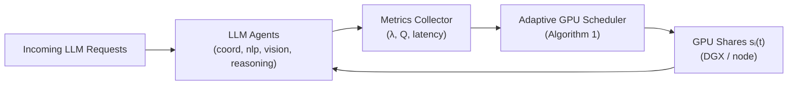

# Adaptive GPU Resource Allocation for Multi-Agent Collaborative Reasoning

Implementation of the paper's Algorithm 1 — priority-weighted, demand-proportional
GPU allocation — evaluated against static and round-robin baselines.

---


---
## Architecture Overview



---
## Quick Start

1. **Install dependencies**

   ```bash
   pip install -r requirements.txt
   pip install -e .          # installs adaptive_gpu as a package
   ```

<<<<<<< HEAD
2. **Run a quick smoke test (30s per policy)**
=======
2. **Run both Backend & Frontend (Single Command)**
   
   ```bash
   python run_app.py
   ```

3. **Run a quick smoke test (30s per policy)**
>>>>>>> e84eab1 (Paper exactly replicated now with some UI changes)

   ```bash
   bash scripts/run_simulation.sh --quick
   ```

<<<<<<< HEAD
3. **Run the full paper comparison (300s × 3 repeats)**
=======
3. **Run the full paper comparison (100s × 3 repeats)**
>>>>>>> e84eab1 (Paper exactly replicated now with some UI changes)

   ```bash
   bash scripts/run_simulation.sh
   ```

Results appear in `output/metrics/` (CSV) and `output/figures/` (PNG charts).

---

## Project Structure

```text
adaptive-gpu-scheduler/
├── configs/                    # All experiment parameters (YAML)
│   ├── agents.yaml             # Agent priorities, min GPU shares, service times
│   ├── workloads.yaml          # Arrival rates (paper Table 1: 80/40/45/25 req/s)
│   ├── policies.yaml           # Policy-specific settings
│   └── experiment_default.yaml # Links all configs for a standard run
│
├── src/adaptive_gpu/
│   ├── config/loader.py        # Typed YAML loading with dataclasses
│   ├── agents/                 # 4 agents: coord, nlp, vision, reasoning
│   │   └── base_agent.py       # Queue, service simulation, metrics
│   ├── scheduler/              # THE PAPER'S CORE
<<<<<<< HEAD
│   │   ├── adaptive_allocator.py   # Algorithm 1 (demand + priority + min-share)
=======
│   │   ├── adaptive_allocator.py   # Algorithm 1: d_i=(λ_i×R_i)/P_i  O(N)
>>>>>>> e84eab1 (Paper exactly replicated now with some UI changes)
│   │   ├── static_allocator.py     # Baseline 1: equal static share
│   │   └── round_robin.py          # Baseline 2: rotating boost share
│   ├── workload/generator.py   # Poisson arrival generator (configurable per agent)
│   ├── simulation/
│   │   ├── environment.py      # Worker threads + allocation control loop
│   │   ├── event_loop.py       # Single-run orchestrator
│   │   └── gpu_model.py        # GPU share → service time scaling
│   ├── metrics/                # collector.py, latency, throughput, utilization
│   ├── evaluation/             # compare_policies.py, summarize.py (plots + tables)
│   └── deployment/             # DGX / Docker / endpoint clients
│
├── experiments/
│   ├── exp_static_vs_rr_vs_adaptive.py   # Main paper comparison
│   ├── exp_ablation_priority.py          # Priority weight sensitivity
│   └── exp_realworld_stub.py             # DGX real-endpoint experiment
│
├── scripts/
│   ├── run_simulation.sh       # Run simulation experiment
│   ├── run_baselines.sh        # Run each policy individually
│   ├── run_all_experiments.sh  # Run everything
│   └── launch_all.sh           # DGX: start all 4 vLLM servers
│
└── tests/                      # pytest unit + integration tests
```


## Agents in the System

| Agent      | Role                          | Priority | Notes                          |
|-----------|-------------------------------|----------|--------------------------------|
| 🤝 Coord  | Orchestrates multi-agent calls| High     | Latency-sensitive, small load  |
| 📝 NLP    | Text reasoning / chat         | Medium   | High QPS, moderate latency     |
| 👁️ Vision | Image/multimodal reasoning    | Medium   | Heavier, fewer requests        |
| 🧠 Reason | Complex multi-step reasoning  | High     | Heavy, very latency-sensitive  |

---

## Algorithm 1 — Implementation

Located in `src/adaptive_gpu/scheduler/adaptive_allocator.py`.

<<<<<<< HEAD
=======
Faithfully implements **Algorithm 1** from the paper (arXiv:2512.22149v1, Section III.C):

>>>>>>> e84eab1 (Paper exactly replicated now with some UI changes)
```text
For each agent i:
    d_i = (λ_i × R_i) / P_i

    where:
      λ_i = arrival rate (req/s) in 10-second sliding window
      R_i = minimum GPU resource requirement (fraction of total)
      P_i = priority level (1=high, 2=medium — lower value = more resources)

D_total = Σ d_i
g_i_prop = (d_i / D_total) × G_total   (proportional share)
g_i      = max(R_i, g_i_prop)           (enforce minimum — prevent starvation)

If Σ g_i > G_total:
    g_i = g_i / Σ g_j × G_total        (normalize to capacity)
```

Complexity: **O(N)** — enables millisecond-scale real-time reallocation.

---

## Three Policies Compared

| Policy        | Description                                             | Where                            |
|---------------|---------------------------------------------------------|----------------------------------|
| **adaptive**  | Algorithm 1 — dynamic, demand-aware                     | `scheduler/adaptive_allocator.py` |
| **static**    | Equal share (1/N) for all agents, never changes         | `scheduler/static_allocator.py`   |
| **round_robin** | Rotating boost share across agents                    | `scheduler/round_robin.py`       |

---

## Running Individual Experiments

```bash
# Single policy, custom workload
python -m adaptive_gpu.main --policy adaptive --workload burst_nlp --duration 60

# Priority ablation study
python experiments/exp_ablation_priority.py

# Run all tests
pytest tests/ -v
```

---

## DGX Real-World Deployment (Week 3+)

```bash
# 1. Start all 4 vLLM servers on DGX
bash scripts/launch_all.sh

# 2. Run real-world experiment (auto-detects live endpoints)
python experiments/exp_realworld_stub.py
```

---

## Paper Metrics Reproduced

- Average end-to-end latency per agent (ms)
- Throughput (requests/second) per agent
- SLA violation rate (%) — threshold 200ms
- GPU allocation share over time
- Jain's Fairness Index across all agents

---

## Agent Configuration (configs/agents.yaml)

<<<<<<< HEAD
| Agent     | Priority   | Min GPU Share | Base Latency |
|-----------|------------|---------------|-------------|
| coord     | 1 (high)   | 10%           | 80ms        |
| nlp       | 2 (med)    | 20%           | 120ms       |
| vision    | 2 (med)    | 20%           | 150ms       |
| reasoning | 1 (high)   | 30%           | 200ms       |


## Future Work

- Integrate the simulation backend with a web dashboard (FastAPI + Streamlit/Next.js) for interactive visualization of metrics and allocations.
=======
Values match **Paper Table I** exactly (arXiv:2512.22149v1):

| Agent     | Model Size | Base Throughput | Min GPU Share | Priority   |
|-----------|------------|-----------------|---------------|------------|
| coord     | 500 MB     | 100 rps (10ms)  | 10%           | 1 (high)   |
| nlp       | 2000 MB    | 50 rps  (20ms)  | 30%           | 2 (med)    |
| vision    | 1500 MB    | 60 rps  (16.7ms)| 25%           | 2 (med)    |
| reasoning | 3000 MB    | 30 rps  (33.3ms)| 35%           | 1 (high)   |

Arrival rates (Paper Table I): coord=80 rps, nlp=40 rps, vision=45 rps, reasoning=25 rps.
>>>>>>> e84eab1 (Paper exactly replicated now with some UI changes)
