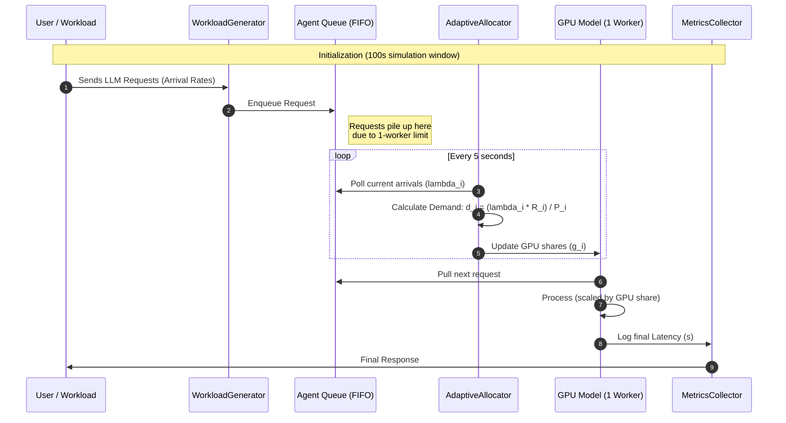

# Adaptive GPU Scheduler — System Flow

This diagram visualizes the request lifecycle and the asynchronous adaptive allocation loop.

### Key Components:
1. **Queue (FIFO):** With `n_workers=1`, this queue becomes the bottleneck, creating the **seconds of latency** shown in the research paper.
2. **Adaptive Loop:** Independently updates GPU shares every 5 seconds using the paper's specific formula.
3. **GPU Model:** Scales the base service time (10ms-33ms) by the allocated share.
